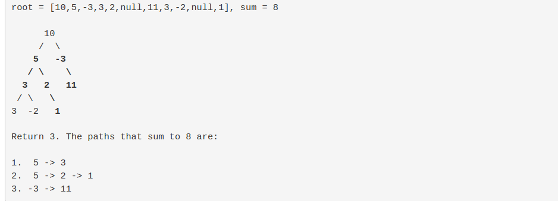

## Path sum problem 
- consider a path from a to b in a binary tree  how many path are possible  such that sum of the each node value is equal to given target . 

```
class Solution{

public:
    int pathSum(TreeNode* root, int sum) {
        unordered_map<int, int> m; 
        int total = 0;
        helper(root, 0, sum, total, m);
        return total;
    }
    
    void helper(TreeNode *p, int cur, int sum, int &total, unordered_map<int, int> &m)
    {
        if (!p) return;
        
        cur += p->val;
        if(cur==sum)
            total++;
            //if (m.count(cur-sum)) 
            total += m[cur - sum];
        m[cur]++;
        
        helper(p->left, cur, sum, total, m);
        helper(p->right, cur, sum, total, m);
        
        m[cur]--;
    }
};

```



### Time complextiy of the problem to find occurence of element twice in a given array that is O(N).

#### 


## Rotten oranges 

```
class Solution {
public:
    // main function
    int orangesRotting(vector<vector<int>>& grid) {
        // grid size
        m = grid.size();
        n = m == 0 ? 0 : grid[0].size();
        
        int d = 0; // minutes taken
        int fresh = numFreshOranges(grid);
        int oldfresh = fresh;
        // easier to understand using while loop, fresh orange num > 0
        while (oldfresh > 0) {
            for (int i = 0; i < m; ++i) {
                for (int j = 0; j < n; ++j) {
                    if (grid[i][j] == d+2) {
                        fresh -= (rot(grid, i-1, j, d) + rot(grid, i+1, j, d) + rot(grid, i, j-1, d) + rot(grid, i, j+1, d));
                    }
                }
            }
            if (oldfresh == fresh) return -1; // no more rotten oranges, stop
            else {
                oldfresh = fresh;
                d++;
            }
        }
        return d;
    }
    
private:
    int m;
    int n;
    
    // calculate the num of available fresh oranges
    int numFreshOranges(vector<vector<int>>& grid) {
        int num = 0;
        for (int i = 0; i < m; ++i) {
            for (int j = 0; j < n; ++j) {
                if (grid[i][j] == 1) num++;
            }
        }
        
        return num;
    }

```